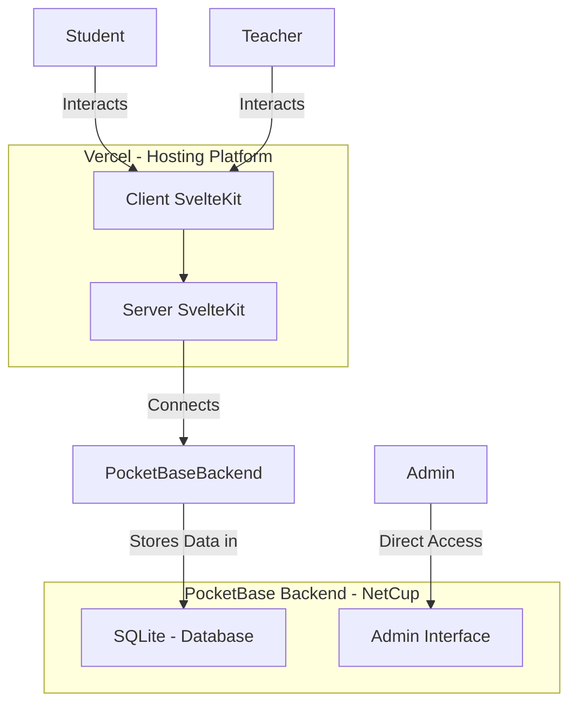
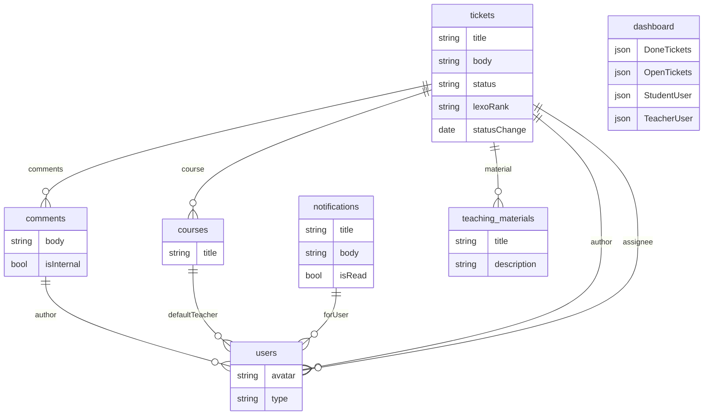

# Infrastructure Architecture

```mermaid
graph TD
    subgraph Vercel [Vercel - Hosting Platform]
        SvelteKitClient[Client SvelteKit] --> SvelteKitServer[Server SvelteKit]
    end

    subgraph PocketBase [PocketBase Backend - NetCup]
        PocketBaseSQLite[SQLite - Database]
        PocketBaseAdmin[Admin Interface]
    end

    UserStudent[Student] -->|Interacts| SvelteKitClient
    UserTeacher[Teacher] -->|Interacts| SvelteKitClient

    SvelteKitServer -->|Connects| PocketBaseBackend
    PocketBaseBackend -->|Stores Data in| PocketBaseSQLite

    Admin -->|Direct Access| PocketBaseAdmin
```

# Data Model

```mermaid
erDiagram
    users {
        string avatar
        string type
    }
    
    comments {
        string body
        bool isInternal
    }
    comments ||--o{ users : "author"
    
    courses {
        string title
    }
    courses ||--o{ users : "defaultTeacher"
    
    notifications {
        string title
        string body
        bool isRead
    }
    notifications ||--o{ users : "forUser"
    
    teaching_materials {
        string title
        string description
    }

    tickets {
        string title
        string body
        string status
        string lexoRank
        date statusChange
    }
    tickets ||--o{ users : "author"
    tickets ||--o{ courses : "course"
    tickets ||--o{ teaching_materials : "material"
    tickets ||--o{ users : "assignee"
    tickets ||--o{ comments : "comments"

    dashboard {
        json DoneTickets
        json OpenTickets
        json StudentUser
        json TeacherUser
    }
```
