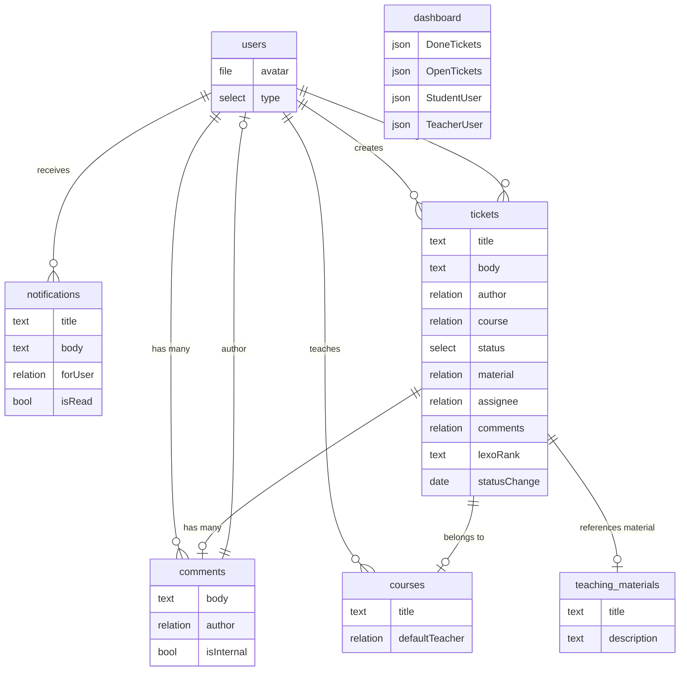

```mermaid
erDiagram
    users {
        file avatar
        select type
    }
    
    comments {
        text body
        relation author
        bool isInternal
    }

    courses {
        text title
        relation defaultTeacher
    }

    notifications {
        text title
        text body
        relation forUser
        bool isRead
    }

    teaching_materials {
        text title
        text description
    }

    tickets {
        text title
        text body
        relation author
        relation course
        select status
        relation material
        relation assignee
        relation comments
        text lexoRank
        date statusChange
    }

    dashboard {
        json DoneTickets
        json OpenTickets
        json StudentUser
        json TeacherUser
    }

    users ||--o{ comments: "has many"
    users ||--o{ courses: "teaches"
    users ||--o{ notifications: "receives"
    users ||--o{ tickets: "creates"
    users ||--o{ tickets: "assigned"
    comments ||--o| users: "author"
    tickets ||--o| comments: "has many"
    tickets ||--o| courses: "belongs to"
    tickets ||--o| teaching_materials: "references material"

```
