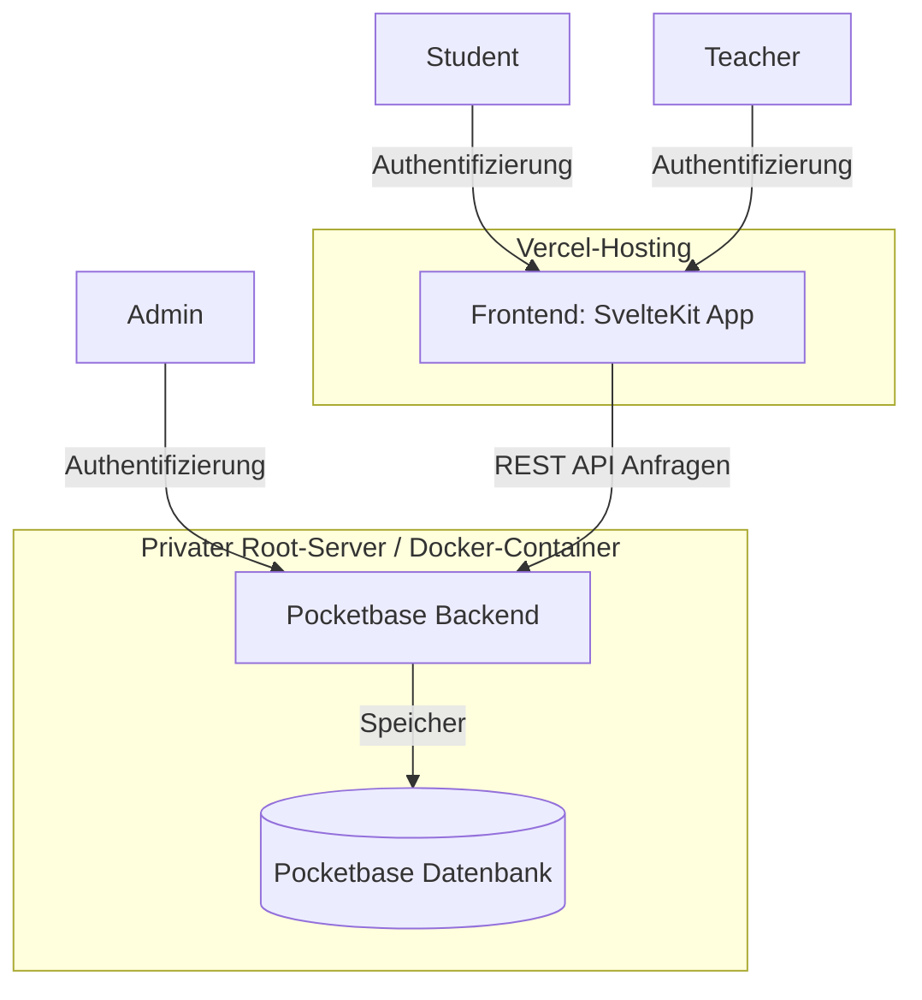
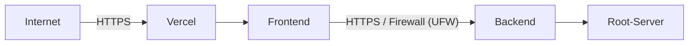

# Systemübersicht

Das **IU-Course-Feedback-System** dient dazu, eine effiziente Kommunikation und Verwaltung von Fehlern und Verbesserungsvorschlägen im Kursmaterial einer Lehranstalt zu ermöglichen. Es ist auf drei Zielgruppen ausgerichtet:

- **Students**: Studierende, die Fehler oder Unklarheiten im Kursmaterial melden können.
- **Teachers**: Lehrkräfte, die gemeldete Tickets auf einem Kanban-Board verwalten und beheben.
- **Admins**: Administratoren, die das System und seine Einstellungen über eine administrative Schnittstelle verwalten.

## Zweck des Systems

Das IU-Course-Feedback-System zielt darauf ab, die Qualität der Lehrinhalte zu verbessern, indem es Studierenden die Möglichkeit bietet, Fehler im Kursmaterial direkt zu melden. Diese Rückmeldungen können von den Lehrkräften über ein Kanban-Board effizient bearbeitet und behoben werden, was eine transparente und schnelle Korrektur ermöglicht.

## Hauptfunktionen

### 1. Studentenansicht

- **Ticketübersicht**: Zeigt alle vom Studierenden gemeldeten Tickets an.
- **Ticket-Detailansicht**: Ermöglicht das Einsehen des Status eines Tickets sowie das Hinzufügen von Kommentaren.

### 2. Teacheransicht

- **Kanban-Board**: Stellt alle Tickets in verschiedenen Statuskategorien dar (z. B. Offen, In Bearbeitung, Geschlossen).
- **Ticket-Detailansicht**: Bietet Lehrkräften die Möglichkeit, Kommentare hinzuzufügen und den Ticketstatus zu aktualisieren, einschließlich interner Kommentare, die nur von Lehrkräften sichtbar sind.

### 3. Admin-Interface

- **Verwaltungsschnittstelle**: Zugriff auf Verwaltungseinstellungen über das Pocketbase-Admin-Interface, z. B. zur Anpassung von Benutzerrechten und Systemparametern.

## Technische Grundlagen

- **Frontend**: Implementiert in **SvelteKit** mit **Shadcn-Svelte** als UI-Framework, gehostet auf **Vercel**. Die Ansichten für Studierende und Lehrkräfte sind geschützt und nur für autorisierte Nutzer zugänglich.
- **Backend**: Entwickelt mit **Pocketbase**, gehostet in einem **Docker-Container** auf einem privaten Root-Server. Die Verwaltung erfolgt über das Pocketbase-Admin-Interface.
- **Deployment**: Das Frontend-Deployment auf Vercel erfolgt automatisiert über **GitHub-Hooks**. Der Quellcode ist auf GitHub gespeichert, während das Schema-Deployment für Pocketbase derzeit manuell erfolgt.

## System-URLs

- **Frontend**: [https://iu-course-feedback.vercel.app/](https://iu-course-feedback.vercel.app/)
- **Backend**: [https://iu-ticketing.65software.dev/](https://iu-ticketing.65software.dev/)

---

# Architekturdokumentation

Die Architektur des **IU-Course-Feedback-Systems** besteht aus mehreren Komponenten, die zusammen eine effiziente und sichere Fehlererfassung und -verwaltung ermöglichen. Die Architektur lässt sich in folgende Hauptbereiche unterteilen:

1. **Frontend**: Eine SvelteKit-Anwendung mit geschützten Ansichten für Studierende und Lehrkräfte, gehostet auf Vercel.
2. **Backend**: Eine Pocketbase-Instanz zur Verwaltung der Ticketdaten und Benutzerrollen, die in einem Docker-Container auf einem privaten Root-Server läuft.
3. **Datenbank**: Pocketbase übernimmt sowohl das Backend als auch die Datenbankverwaltung.
4. **Deployment**: Automatisiert für das Frontend via GitHub-Hooks, manuell für das Backend-Schema.

## Architekturdiagramm

Das folgende Diagramm zeigt die Interaktionen und Kommunikationsflüsse der einzelnen Komponenten im System:

## Komponentenbeschreibung

### 1. Frontend

Die SvelteKit-Applikation dient als Benutzeroberfläche für Studierende und Lehrkräfte und ist auf Vercel gehostet. Die Applikation verwendet Shadcn-Svelte als UI-Framework und bietet jeweils personalisierte und geschützte Ansichten, die nur für die entsprechenden Benutzergruppen zugänglich sind. Wichtige Seiten umfassen:

Studentenansicht: Übersicht über gemeldete Tickets und Detailansicht.
Teacheransicht: Kanban-Board und Detailansicht zur Ticketbearbeitung.

### 2. Backend

Das Pocketbase-Backend übernimmt die Datenverwaltung und Benutzerrollensteuerung. Es ist in einem Docker-Container auf einem privaten Root-Server des Unternehmens gehostet und kommuniziert über eine REST API mit dem Frontend. Pocketbase ermöglicht:

Admin-Zugang über eine eigene administrative Oberfläche.
Datenpersistenz für Tickets, Benutzer und Kommentare.

### 3. Datenbank

Pocketbase enthält eine integrierte Datenbank, die alle notwendigen Informationen speichert. Dazu gehören:

Tickets: Mit Angaben zu Status, Ersteller und zugehörigen Kommentaren.
Benutzerdaten: Für Authentifizierungs- und Autorisierungszwecke.
Kommentare: Eingefügt von Lehrkräften oder Studierenden im Zusammenhang mit einem Ticket.

### 4. Deployment

Frontend: Die SvelteKit-App wird automatisch über GitHub-Hooks auf Vercel bereitgestellt, sobald neue Änderungen auf GitHub eingecheckt werden.
Backend: Derzeit erfolgt das Schema-Deployment für die Pocketbase-Datenbank manuell. Zukünftig könnte dieser Prozess durch Skripte oder CI/CD automatisiert werden.

### Datenfluss

Studenten melden Fehler oder Fragen im Kursmaterial über die Studentenansicht.
Die Teacheransicht zeigt alle eingehenden Meldungen im Kanban-Board-Format, wo Lehrkräfte den Status aktualisieren und Kommentare hinzufügen können.
Admins verwalten das System, kontrollieren Benutzerrollen und führen Wartungsarbeiten direkt über das Pocketbase-Interface auf dem Root-Server durch.

---

# Wartungs- und Supportdokumentation

Diese Wartungs- und Supportdokumentation beschreibt die notwendigen Maßnahmen, um das **IU-Course-Feedback-System** stabil und sicher zu betreiben. Sie umfasst regelmäßige Wartungsaufgaben, Verfahren zur Fehlerbehebung, Backups sowie Updates.

## 1. Regelmäßige Wartungsaufgaben

### Frontend-Wartung (SvelteKit-Anwendung auf Vercel)

- **Verfügbarkeit und Statusprüfung**: Tägliche Überprüfung der Verfügbarkeit über die Vercel-Statusseite.
- **GitHub-Hook-Check**: Sicherstellen, dass die automatischen Deployments über GitHub-Hooks reibungslos funktionieren und bei Bedarf fehlerhafte Deployments analysieren.
- **Protokollprüfung**: Wöchentliche Überprüfung der Anwendungsprotokolle in Vercel auf Fehler oder Warnungen.

### Backend-Wartung (Pocketbase auf Docker-Container)

- **Container-Status-Check**: Wöchentliche Überprüfung des Docker-Containers, um sicherzustellen, dass Pocketbase stabil läuft. Neustarts bei Speicherproblemen oder unerwarteten Fehlern vornehmen.
- **Datenbank-Integrität**: Monatliche Prüfung der Datenbankintegrität in Pocketbase, um Datenfehler oder Inkonsistenzen zu identifizieren und zu beheben.
- **Ressourcenüberwachung**: Tägliche Kontrolle der Server-Ressourcennutzung (CPU, RAM, Speicherplatz) zur Vermeidung von Engpässen.

## 2. Fehlerbehebung

### Häufige Fehler und Lösungen

| Problem                        | Beschreibung                                | Lösung                                                                                      |
| ------------------------------ | ------------------------------------------- | ------------------------------------------------------------------------------------------- |
| **Frontend nicht erreichbar**  | Vercel-Deployment ist fehlgeschlagen        | Überprüfung der Deployment-Protokolle auf GitHub und Vercel, fehlerhafte Builds analysieren |
| **Backend antwortet nicht**    | Docker-Container funktioniert nicht korrekt | Container neu starten und Serverprotokolle auf Fehler prüfen                                |
| **Authentifizierungsprobleme** | Fehler beim Login der Nutzergruppen         | Überprüfen der Konfiguration und ggf. Benutzerrollen in Pocketbase anpassen                 |
| **Datenbankinkonsistenzen**    | Tickets oder Kommentare fehlen              | Datenbankwartung durchführen und Pocketbase auf Integritätsprobleme untersuchen             |

## 3. Backups

### Backup-Strategie

Um die Daten des Systems vor Verlust zu schützen, wird die folgende Backup-Strategie empfohlen:

- **Frontend-Code**: Automatische Versionierung und Sicherung über GitHub.
- **Pocketbase-Datenbank**:
  - **Tägliche Backups**: Vollständige Datenbank-Backups werden täglich gespeichert.
  - **Speicherort**: Backups werden auf einem separaten, sicheren Speicher auf dem Root-Server abgelegt.
  - **Retention**: Backups der letzten 30 Tage werden aufbewahrt, ältere werden automatisch gelöscht.

### Wiederherstellungsverfahren

1. **Backup-Überprüfung**: Regelmäßige Überprüfung der Backups auf Konsistenz und Lesbarkeit.
2. **Wiederherstellungsschritte**:
   - Docker-Container stoppen.
   - Die Pocketbase-Datenbank durch das entsprechende Backup ersetzen.
   - Docker-Container neu starten und Systemverfügbarkeit testen.

## 4. Updates

### Frontend-Updates (SvelteKit & Shadcn-Svelte)

- **Dependencies**: Monatliche Überprüfung und Aktualisierung der Abhängigkeiten in `package.json` zur Sicherheit und Kompatibilität.
- **Framework-Updates**: Vierteljährliche Prüfung auf neue Versionen von SvelteKit und Shadcn-Svelte, ggf. durchführen.

### Backend-Updates (Pocketbase)

- **Pocketbase-Version**: Vierteljährliche Prüfung auf neue Versionen von Pocketbase und Update der Docker-Images.
- **Docker-Updates**: Monatliche Aktualisierung der Docker-Umgebung, um sicherzustellen, dass Sicherheitslücken und Stabilitätsprobleme behoben sind.

## 5. Monitoring und Benachrichtigungen

- **Uptime-Monitoring**: Einrichten eines Uptime-Monitoring-Dienstes (z. B. UptimeRobot) zur Überwachung der Erreichbarkeit des Frontends und Backends.
- **Benachrichtigungskonfiguration**: Administratoren werden bei Ausfällen und kritischen Fehlern per E-Mail oder Messaging-Dienst (z. B. Slack) benachrichtigt, um schnell reagieren zu können.

---

# Sicherheitskonzepte

Das Sicherheitskonzept für das **IU-Course-Feedback-System** gewährleistet den Schutz sensibler Daten, sichert den Zugriff auf die verschiedenen Benutzergruppen und minimiert potenzielle Bedrohungen. Die Sicherheitsmaßnahmen umfassen Zugriffssteuerung, Netzwerkschutz, Datenverschlüsselung sowie regelmäßige Sicherheitsprüfungen und Updates.

## 1. Zugriffskontrolle und Benutzerrechte

Das System umfasst drei Benutzergruppen (Students, Teachers und Admins), die jeweils spezifische Berechtigungen und Zugriffseinschränkungen haben. Die Authentifizierung und Autorisierung der Benutzer erfolgt über das Backend (Pocketbase).

### Benutzergruppen und Berechtigungen

| Benutzergruppe | Berechtigungen                                                                                                                             |
| -------------- | ------------------------------------------------------------------------------------------------------------------------------------------ |
| **Student**    | Kann eigene Tickets erstellen und einsehen, Kommentare zu Tickets hinzufügen, Profil- und Sicherheitseinstellungen anpassen                |
| **Teacher**    | Kann alle Tickets im Kanban-Board einsehen, Status ändern, interne Kommentare hinzufügen und Profil- und Sicherheitseinstellungen anpassen |
| **Admin**      | Vollzugriff über die Pocketbase-Admin-Oberfläche, Verwaltung der Benutzer, Datenbankwartung und Systemkonfiguration                        |

### Authentifizierung

- **JWT-Token**: Alle Benutzersitzungen werden durch JSON Web Tokens (JWTs) authentifiziert, die nur für die jeweils zugehörige Benutzergruppe gültig sind.
- **Token-Verwaltung**: Tokens werden regelmäßig erneuert und sind an kurze Ablaufzeiten gebunden, um das Risiko eines Missbrauchs zu minimieren.

## 2. Netzwerk- und Kommunikationssicherheit

### HTTPS-Verschlüsselung

- **Frontend und Backend**: Alle Verbindungen zwischen dem Frontend auf Vercel und dem Backend auf dem Root-Server erfolgen über HTTPS, um die Übertragung sensibler Daten (z. B. Zugangsdaten und Ticketinformationen) zu schützen.

### Firewall und Zugangsbeschränkungen

Das Backend ist durch eine Firewall (ufw) auf dem Root-Server geschützt:

- **Zugriffsbeschränkung**: Der Zugang zum Backend ist auf HTTPS-Verbindungen beschränkt, und nur der Port 443 ist für externe Anfragen geöffnet. Alle anderen Ports sind durch die Firewall blockiert.
- **Admin-Zugang**: Der Admin-Zugang zur Pocketbase-Datenbank ist nur über spezifische IP-Adressen erlaubt, wodurch unautorisierte Zugriffe von externen Quellen verhindert werden.

## 3. Datenverschlüsselung

### Verschlüsselung sensibler Daten

- **Passwort-Hashing**: Benutzerpasswörter werden vor der Speicherung sicher gehasht (z. B. mit bcrypt), um unbefugten Zugriff auf Zugangsdaten zu verhindern.
- **Datenbankverschlüsselung**: Die Pocketbase-Datenbank auf dem Root-Server wird durch eine Datenverschlüsselung auf Betriebssystemebene abgesichert, um die Datenintegrität bei physischem Zugriff auf den Server zu gewährleisten.

## 4. Sicherheitsprüfungen und Updates

### Regelmäßige Sicherheitsprüfungen

- **Code-Reviews**: Alle Änderungen am Frontend und Backend werden durch regelmäßige Code-Reviews überprüft, um potenzielle Schwachstellen frühzeitig zu erkennen.
- **Vulnerability Scanning**: Monatliche Scans auf bekannte Sicherheitslücken und Schwachstellen (z. B. durch Tools wie `npm audit` oder Docker-Sicherheitsprüfungen).

### Update-Richtlinien

- **Abhängigkeiten**: Monatliche Überprüfung und Aktualisierung der externen Bibliotheken und Abhängigkeiten im Frontend (SvelteKit, Shadcn-Svelte) und Backend (Pocketbase, Docker).
- **Sicherheits-Patches**: Sicherheits-Patches für Betriebssystem, Docker und andere Server-Komponenten werden sofort eingespielt, sobald sie verfügbar sind.

## 5. Protokollierung und Überwachung

- **Protokollierung sicherheitsrelevanter Ereignisse**: Alle sicherheitsrelevanten Aktionen (z. B. Login-Versuche, Rollenänderungen, Token-Verlängerungen) werden protokolliert und regelmäßig überprüft.
- **Alerting**: Administratoren werden bei verdächtigen Aktivitäten automatisch benachrichtigt, um schnell auf mögliche Sicherheitsvorfälle reagieren zu können.

---
